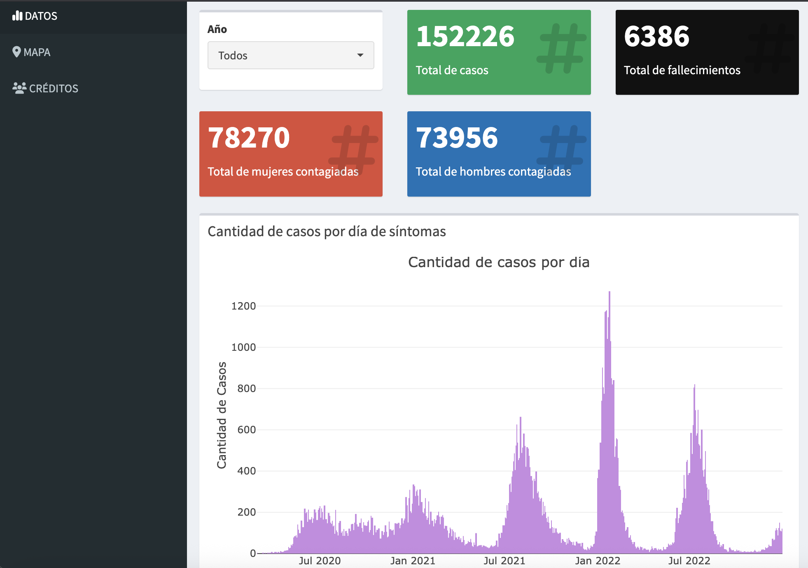
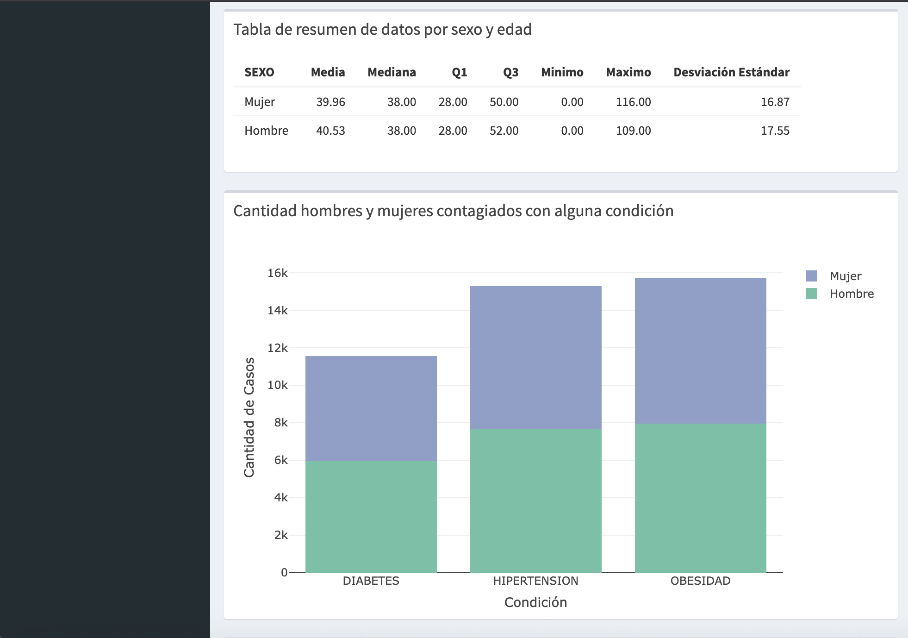
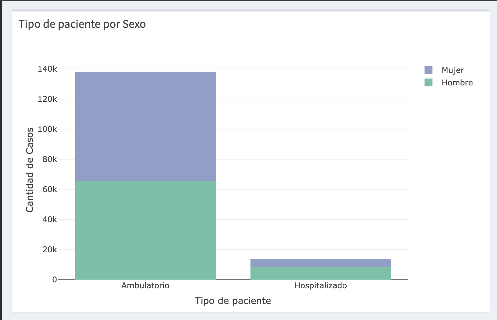
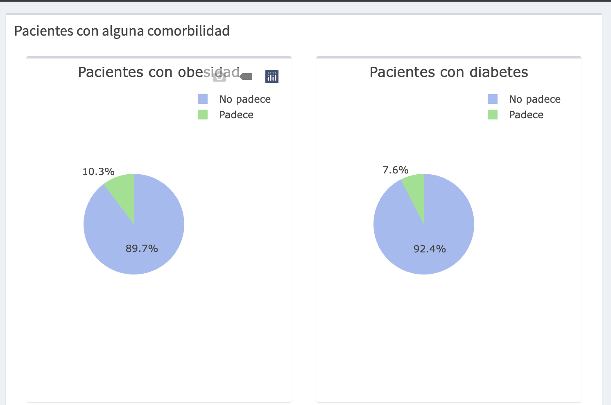
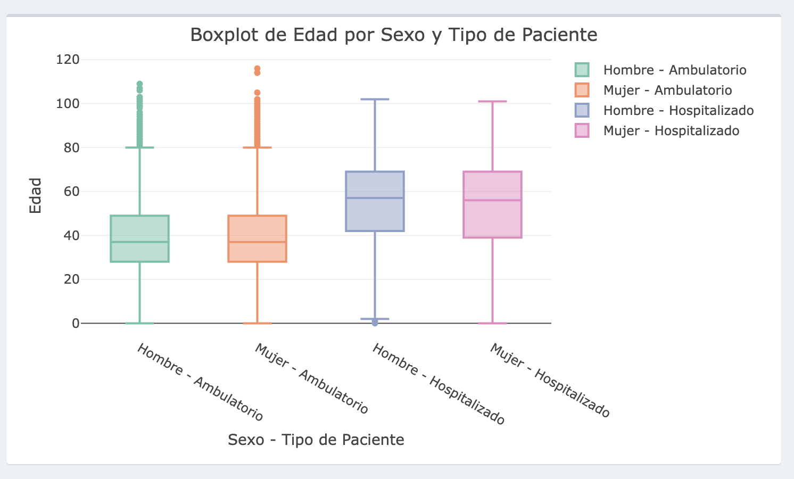
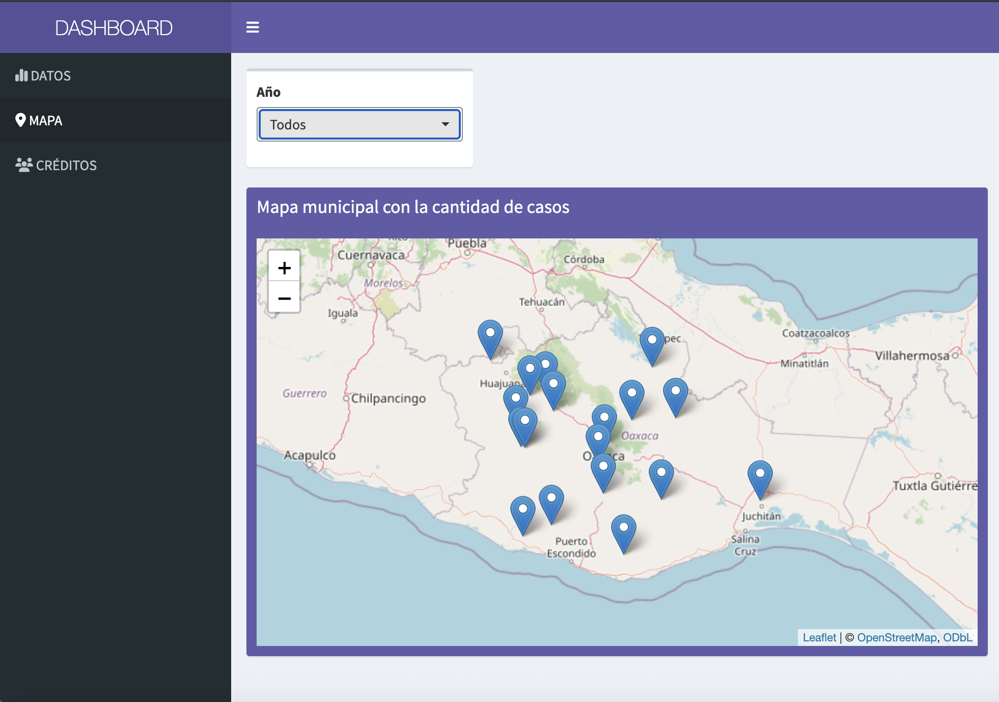

# R Statistical Analysis: COVID-19 Dashboard (Oaxaca)

Este proyecto es un tablero interactivo desarrollado en **R** con **Shiny** que analiza y visualiza datos de COVID-19 del estado de **Oaxaca, México**, desde el año 2020 al 2022. Fue creado como proyecto final para la materia de **Estadística (2024-2)** en la Licenciatura en Ciencias de la Computación.

> El dashboard se puede explorar en línea a través de [ShinyApps.io](https://v1ahei-ana0laura-chenoweth0galaz.shinyapps.io/Script/)

---

## Funcionalidades principales

- Exploración dinámica de casos confirmados de COVID-19 por año.
- Análisis estadístico por edad, sexo y comorbilidades.
- Gráficos interactivos (barras, histogramas, boxplots, pastel).
- Mapa con geolocalización de casos por municipio.
- Filtros para segmentar la información en tiempo real.

---

## Visualizaciones del sistema

### Panel de estadísticas
<p align="center">
    
    
    
    
    
</p>


### Mapa interactivo



---


## Tecnologías y herramientas utilizadas

- **Lenguaje:** R
- **Framework:** [Shiny](https://shiny.rstudio.com/)
- **Visualización:** plotly, leaflet, shinydashboard
- **Manipulación de datos:** dplyr, tidyr, readr
- **Interfaz:** shinydashboard + shinyWidgets

---

## Estructura del proyecto

```

Proyecto_Estadistica-main/
├── Script/
│   ├── App.R                 # Código principal de la app Shiny
│   ├── Filtro.R              # Limpieza y filtrado de datos originales
│   ├── AuxMap.R              # Datos geográficos de municipios
│   ├── Data/                 # Archivos CSV filtrados (no subidos al repo por tamaño)
│   └── rsconnect/            # Configuración de despliegue en shinyapps.io

```

---

## Cómo ejecutar localmente

1. Clona el repositorio:

```bash
git clone https://github.com/ana-chenoweth/r-statistical-analysis.git
cd r-statistical-analysis/Script
```

2. Abre el proyecto en RStudio y asegúrate de instalar los paquetes necesarios:

```r
install.packages(c("shiny", "shinydashboard", "plotly", "leaflet", "dplyr", "tidyr", "readr", "shinythemes", "shinyWidgets"))
```

3. Ejecuta la aplicación:

```r
shiny::runApp()
```

> Los archivos CSV originales no están incluidos en el repositorio debido a su tamaño. Puedes usar los archivos filtrados dentro de `Script/Data/` o generar los tuyos ejecutando `Filtro.R`.

---

## Créditos

Proyecto desarrollado por:

- Denisse Antúnez López 
- Ana Laura Chenoweth Galaz  
- Georgina Salcido Valenzuela  
- Omar Pacheco Velázquez  

Profesora: **Mayra Rosalía Tocto Erazo**

---

## Enlace a la app en producción

[https://v1ahei-ana0laura-chenoweth0galaz.shinyapps.io/Script/](https://v1ahei-ana0laura-chenoweth0galaz.shinyapps.io/Script/)

---

## Licencia

Este proyecto es de carácter académico. Para uso o distribución, contactar a los autores.
